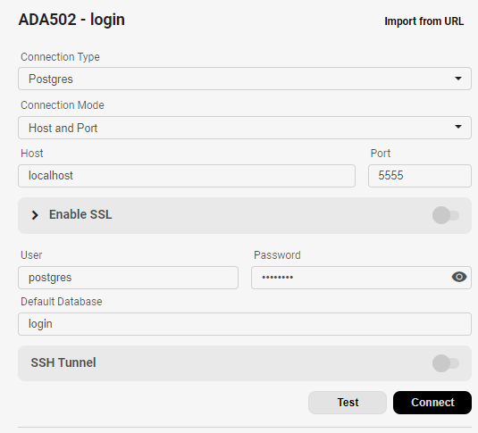

# ADA502 - Cloud - firerisk

A brief description of what this project does and who it's for.

## Pre-requisites

For å kjøre prosjektet vil jeg anbefale følgende verktøy:

- Beekeeper (database)
https://www.beekeeperstudio.io/

- Docker desktop
https://www.docker.com/products/docker-desktop/

- Mer?

## Cloning the Repository

To clone this repository, run the following command in your terminal:

git clone https://github.com/ADA502-gruppe8/ADA502-kode.git

Dette laster ned hele prosjektet, og gjør deg klar! 

## Struktur

Det burde nå være en struktur som følger med mappene:

-   src
-   tests

Resten av filene

Er det en mappe med navn "data", så må den slettes. Hvis den ikke er der, så hopp over denne linjen.

Det må opprettes en .env fil, som ligger i den ytterste mappen "ADA502-Kode"

## .env fil

.env filen må opprettes, og innholde disse feltene
Du må fylle ut linje 2 og 3 med dine data.

DATABASE_HOST = 'localhost'

DATABASE_USERNAME = ''

DATABASE_PASSWORD = ''

DATABASE_PORT='5555'

DATABASE_LOGIN = 'login'

DATABASE_FIRERISK ='firerisk'

SECRET_KEY ="jeppepåberget"

Secret_key er ikke i bruk, så den er ikke viktig nå. Dette er for å slippe en feilmelding.

## Kjøring

For å kjøre prosjektet, skriv følgende i terminal

docker compose build

docker compose up

Dette starter docker container, som inneholder 2 sub conteinere
- En for web app, og en for database

Det vil dukke opp en folder "data", som vil være databasen, og lagd i prosjektet

## Docker

Etter å kjørt dokcer compose build/up, burde man finne dette inne i docker desktop

## Beekeeper

Du kan bruke uansett hvilket sql verktøy, men vi viser i beekeeper studio

"New connection" i venstre hjørnet

velg "Postgres" som connection type

Deretter bruker du:

Host = localhost
port = 5555
User = "navn fra .env fil"
Password = "passord fra .env fil"
Default Database = "login" eller "firerisk"

Dette vil gi de 2 bildene under. 

Anbefaler å gi de navn, og lagre forbindelsene til neste gang

Du ser forskjellen i siste linje mellom login og firerisk i bildene under.

## Webapp

Webappen kjører og du skal finne den på "[localhost:5000](http://localhost:5000/)"

Når du kjører appen så kommer den med "Uvicorn running on http://0.0.0.0:5000" , men du må bruke (http://localhost:5000/)

Der vil du komme til ulike interface

Den vil kunne kjøre mellom de ulik nettsidene.

For å logge inn må feltet være != 0 i logginn

Ved opprettelse vil det komme i databasen, og lage en bruker & gå videre til neste

Location vil kunne gi deg mulighet til å skrive inn en lokasjon, eller bruke gps.
Begge disse vil gi deg resultatsiden, som ikke viser noe data enda.

Dette fordi vi ikke har gjort ferdig denne delen av logikken.

Du kan alltid slette brukeren, men slettes ikke nå i databasen. 

Håper alt fungerte! 
